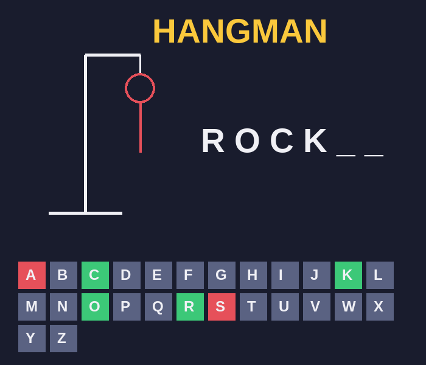
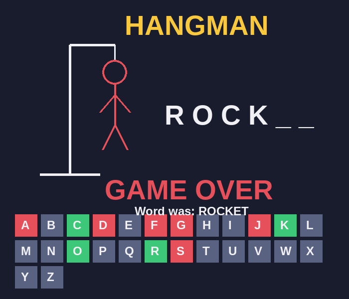

# Hangman

A classic word game written in Python, in two versions that play identically:
a **terminal** game you type into, and a **window** game you click.

<p align="center">
  
</p>

## What it is

Hangman, written as a way to put the fundamentals of Python to work in something
that actually runs — loops, lists, conditionals, functions, string handling and
`random` doing real work rather than sitting in an exercise.

The terminal version is built from core Python only — variables, lists, loops,
functions and `random` — and draws the hangman with ASCII art. The window
version takes that exact guessing logic and puts a mouse and a real drawing on
top of it using `pygame`. Nothing about the rules changes between them; only the
way you interact with the game does.

The whole thing was built in small runnable stages rather than all at once, and
each stage is kept in the repository so the path from a twenty-line script to
the finished game is visible.

## Features

- **A secret word chosen at random** from a built-in list each round.
- **Letter-by-letter guessing** with the word revealed in place as you get
  letters right.
- **Six wrong guesses allowed.** The hangman is drawn one body part at a time,
  so the picture itself is the countdown.
- **Input checks** that catch multi-character input and letters you have already
  tried, without costing you a life.
- **Win and lose screens**, and the option to play another round.
- **Colour-coded letter buttons** in the window version: green once a letter
  turns out to be in the word, red once it doesn't — so the board doubles as a
  record of everything you have tried.

## The two versions

### The window

Click any of the 26 letter buttons to guess. The gallows and figure are drawn
with `pygame` line and circle calls, one part per wrong guess. When the round
ends, the answer is revealed and a click anywhere starts a new one.

<p align="center">
  
</p>

### The terminal

The same game with typed input and an ASCII drawing:

```
==============================
      WELCOME TO HANGMAN
==============================

     +---+
     O   |
     |   |
         |
    =======
Word:  _ o c k e t
Wrong guesses left: 4
Guess a letter:
```

## Run it

The terminal version needs nothing but Python:

```bash
cd terminal
python hangman.py
```

The window version needs pygame, installed once:

```bash
pip install -r requirements.txt
cd gui
python hangman_gui.py
```

## What's inside

```
hangman-python/
├── terminal/
│   ├── hangman.py            the finished terminal game
│   └── build_steps/          the same game, built up in four stages
│       ├── step1_pick_word.py
│       ├── step2_guessing.py
│       ├── step3_win_lose.py
│       └── step4_drawing.py
├── gui/
│   └── hangman_gui.py        the clickable pygame version
├── docs/
│   ├── BUILD_GUIDE.md        the reasoning behind each step
│   └── images/               the screenshots above
├── words.txt                 a longer word list
└── requirements.txt
```

## How it was built

Instead of writing the whole game at once, it was built in four stages. Each
file in `build_steps/` is a complete program that runs on its own and does a
little more than the one before it:

| Step | Adds |
| --- | --- |
| 1 | picks a random word and prints it as blanks |
| 2 | reads letters and reveals them in place |
| 3 | counts wrong guesses, and adds winning and losing |
| 4 | draws the hangman and offers a rematch |

The point of working this way is that there is never a broken, half-finished
program sitting on disk — every stage ends with something you can actually play,
which makes it obvious where a bug was introduced. `docs/BUILD_GUIDE.md` walks
through each stage and the idea it introduces.

The window version came last on purpose. Its guessing logic is the same as the
terminal game's, so the only genuinely new things in it are opening a window,
drawing by coordinate, and reading mouse clicks.

## Concepts used

**Terminal** — `random.choice` to pick the word, a list to remember which
letters have been tried, a `while` loop for the round, `if`/`elif`/`else` for
the input checks, string building to render the blanks, and a list of drawings
indexed by the number of wrong guesses so `pictures[wrong]` is always the right
picture.

**Window** — `pygame`: creating a window and a game loop, `pygame.Rect` plus
`collidepoint` to work out which letter was clicked, and `draw.line` and
`draw.circle` to build the figure one body part at a time.

## Ideas for the next version

- read the words from `words.txt` instead of the hard-coded list
- add categories (animals, space, food) and let the player pick one
- keep a score or a streak across rounds
- add a hint that reveals a letter at the cost of a guess
